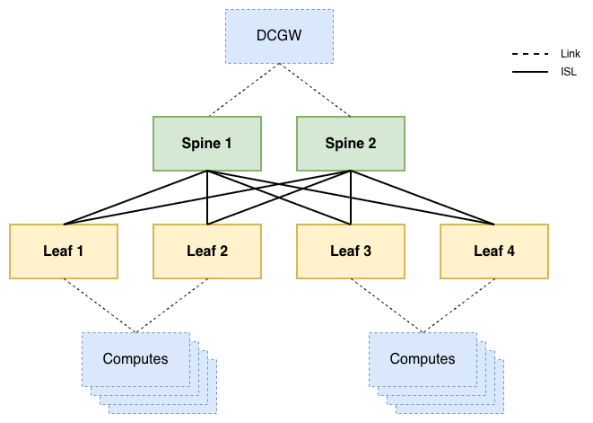
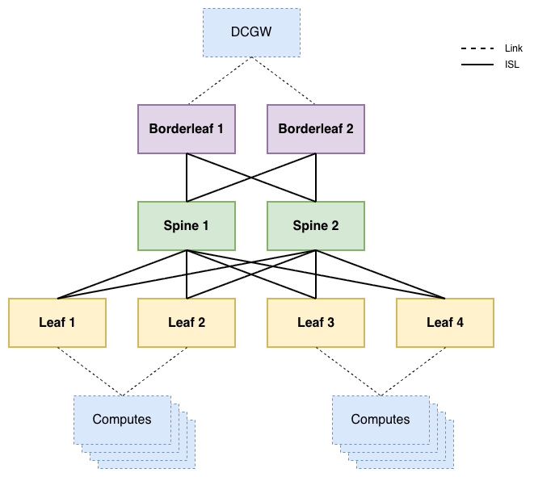
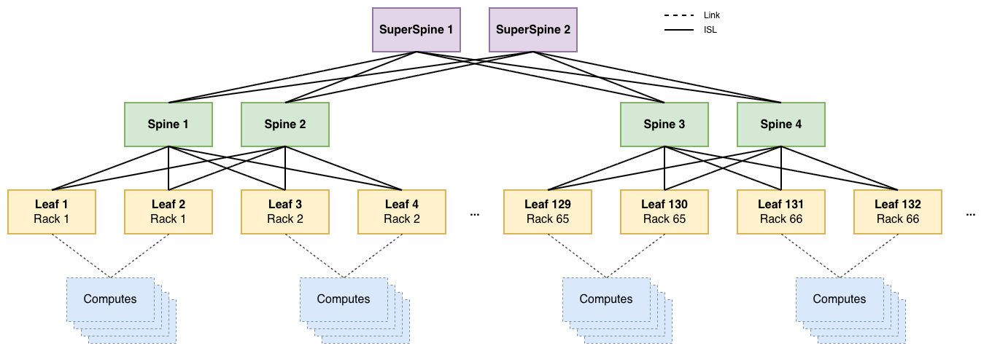
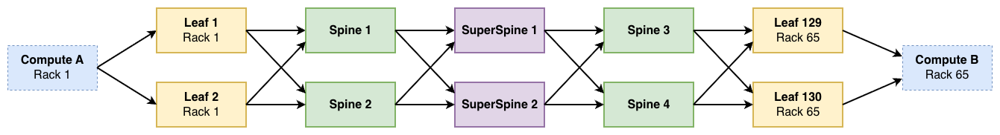

# Fabrics Application

-{}-

| <nbsp> {: .hide-th } |                                         |
| -------------------- |-----------------------------------------|
| **Group/Version**    | -{{ app_group }}-/-{{ app_api_version }}-   |
| **Supported OS**     | -{{ supported_os_versions() }}-  |
| **Catalog**          | [Nokia/catalog/fabrics ][manifest] |
| **Source Code**      | <small>coming soon</small>              |

[//]: # (Note: you should fill in the hyperlink to your published manifest in your public catalog)
[manifest]: https://docs.eda.dev/

The resources in the fabrics application are all about abstraction and generalization: how can a full network be built with just one resource, trading fine-grained control for operational simplicity. This trade-off also means that the resources in this application, especially the [`Fabric`](resources/fabric.md) resource, are slightly opinionated: it assumes a leaf-spine-superspine-borderleaf topology (where one or more layers can be omitted) that will fit for a significant portion of datacenter networks.

The application provides the following components:

/// tab | Resources

* [Fabric](resources/fabric.md)
* [ISL](resources/isl.md)

///

/// tab | Workflows

* [ISLPing](resources/islping.md)
* [FabricTopology](resources/fabrictopology.md)

///

## Fabric topologies

A [`Fabric`](resources/fabric.md) is a collection of network nodes that are interconnected using Inter-Switch Links or [`ISLs`](resources/isl.md). Inter-Switch links are point-to-point links, where each endpoint is a node in the fabric. Edge links that have only one endpoint attached to the [`Fabric`](./resources/fabric.md) are modeled through the `Link` resource.

Clos fabrics are designed to scale with deployment size, ranging from very small to very large networks.

### 2-tier clos Fabric

This topology focuses on small to medium deployments with a couple of racks, where leaf[^1] switches are interconnected through spines[^2]. Leaf switches are often chosen for their port capabilities in terms of speed and connector types, while spine switches are optimized for forwarding capacity.

Typically, computes are attached to [Bridge Domains](../../services.eda.nokia.com/docs/resources/bridgedomain.md) or [Routers](../../services.eda.nokia.com/docs/resources/router.md). To facilitate external connectivity to and from these computes the reachability information with the IP subnets that are available within the fabric are exchanged with Datacenter Gateway[^3] (DCGW) routers using one of two methods:

- PE-CE connection type A: exchange **IP-only** routes using a routing protocol like OSPF or BGP
    - Requires strict separation of IP subnets between datacenter fabrics
- PE-CE connection type B: exchange **service** routes using Multi-Protocol BGP
    - Allows for stretched layer 2 services between fabrics

The requirements of your network determine which type should be used.

### 3-tier clos Fabric

The difference between a 2- and a 3-tier fabric is the addition of **borderleafs**. The borderleaf is required in the case where the spines don't support service termination. In this scenario, the spines only support IP routing for the VXLan transport tunnels, and are not aware of the services that run on the fabric. This is a common occurrence in fabrics with >32 leafs (16 racks). Spines don't scale very well horizontally, since every leaf is supposed to be attached to every spine to limit the number of hops between any two computes.

The borderleafs are functionally the same as leafs, but often differ in port speeds: leafs may have 10 Gbps downlinks towards compute servers, whereas borderleafs provide 100 Gbps connectivity to firewalls, DCGWs[^2], internet gateways, ...

### Clos fabric with superspines

Superspines are introduced in the case where it is no longer feasible to vertically scale the spine nodes, which is typical once the number of leafs exceeds 128 (64 racks). In these hyper-scaled scenarios, the need for an additional hierarchical layer is required

This scaling level means there are at most 6 hops in between any two computes instead of 4.

[^1]: Leaf switches connect directly to computes in the rack, and are often called top-of-rack switches. Commonly deployed in pairs for redundancy.
[^2]: Spine switches interconnect leaf switches, and often take on the role of route reflectors for the EVPN routes of the entire fabric. Commonly deployed in pairs for redundancy
[^3]: Datacenter Gateways or DCGWs are a generic name for routers that interconnect datacenters with each other and the WAN network